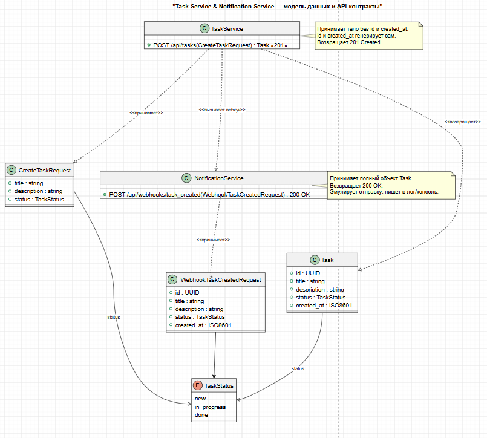

@startuml
title Схема данных: Task

class Task {
  + id : UUID
  + title : string
  + description : string
  + status : TaskStatus
  + created_at : ISO8601
}

enum TaskStatus {
  new
  in_progress
  done
}

class CreateTaskRequest {
  + title : string
  + description : string
  + status : TaskStatus
}

class TaskCreatedWebhook {
  + event : string = "task_created"
  + task : Task
  + timestamp : ISO8601
}

Task "1" -- "1" TaskStatus : status
CreateTaskRequest ..> Task : создаёт
TaskCreatedWebhook "1" *-- "1" Task : содержит
@enduml

